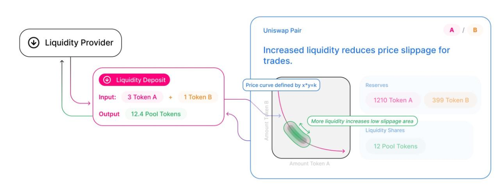
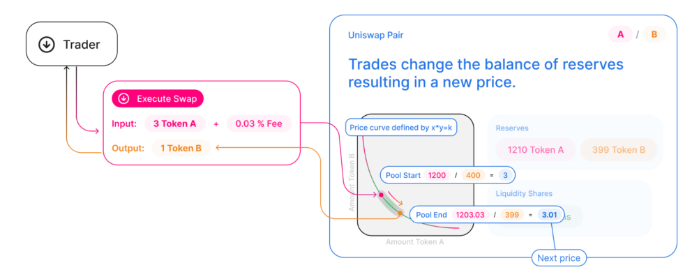

# Uniswap V2 Arb Project

* Project Structure
    * `uniswap_arb.py` - Main logic and code
    * `uniswap_tests.py` - Test cases for swap method
    * `uniswap_benchmark.py` - Benchmark for arbitrage calculation
    * `uniswap_arbitrage.ipynb` - Jupyter notebook for analysis
* Description
    * A take-home assignment given by a crypto HFT firm to calculate arbitrage opportunities between two Uniswap V2 pools.


## Uniswap V2 Protocol
This picture shows how a single Uniswap V2 pool is constructed by the LP (liquidity provider):
<center>

</center>
What happens when a trader swaps with the pool:
<center>

</center>

<br>
<br>

The class `UniswapPool` implements the Uniswap V2 pool logic, with the `add_liquidity`, `remove_liquidity` and `swap` methods. The pool values were referenced from this [v2 pool](https://v2.info.uniswap.org/pair/0xa478c2975ab1ea89e8196811f51a7b7ade33eb11). When run:

```
Randomize inputs? [y/n]: n
Enter DAI in pool A (X1): 7400000
Enter ETH in pool A (Y1): 5000
Enter DAI in pool B (X2): 7500000
Enter ETH in pool B (Y2): 4000
ETH in: 243.79791307173326 | ETH profit: 29.792787666814377
Buy DAI in pool B with 243.79791307173326 ETH and sell it in pool A for a profit of 29.792787666814377
```


## Arbitrage Calculation Logic

The profit function, given constants $X_1, Y_1, X_2, Y_2$, fee constant $\gamma=0.997$ and $k_i = X_i * Y_i$ and initial ETH input $y'$ can be written as: $$P(y')=Y_2 - \frac{k_2}{X_2 + \gamma[X_1 - \frac{k_1}{Y_1 + \gamma \cdot y' }]} - y'$$ Which simulates swapping ETH to DAI in the pool where DAI is cheaper, then selling that DAI for ETH in the pool where DAI is more expensive. `scipy.optimize` was used to find maximum.

## Test Cases

* (In)valid ratio in adding/removing liquidity via `add_liquidity` and `remove_liquidity`
* (In)valid input token amounts (negative or zero tokens) in constructing the `UniswapPool` or in calling the `swap` function
* `k` always increasing after `swap` is called


